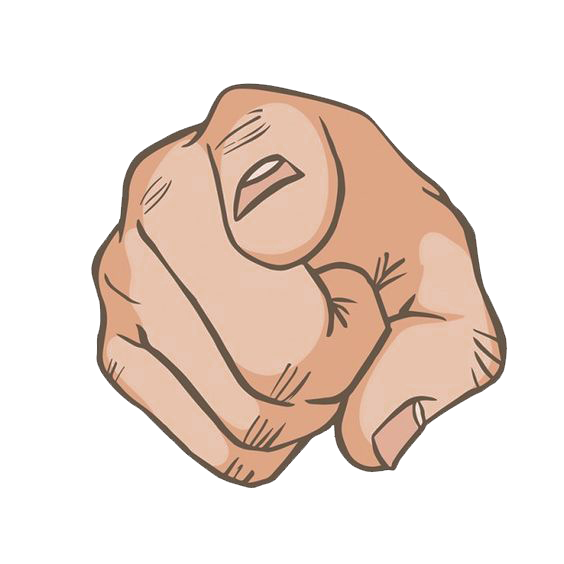
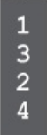

 # Ejercicio de Channels

## Descripcion
Reemplaza los "__" con lo que corresponda para que el codigo use los valores recibidos de dos channels y produzca la siguiente salida"

## Resultado

## ⚠️ No intentes compilar el codigo antes de reemplazar los "__", no sabes como se lo puede tomar Go!
## Links

* [Ejemplo de Channels](https://gobyexample.com/channels). 
